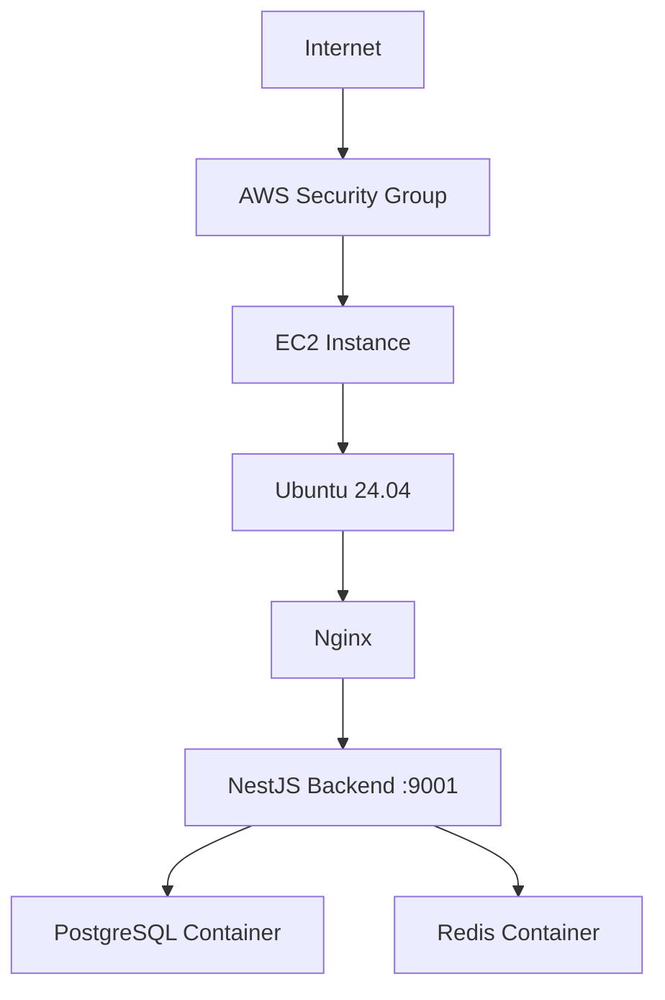
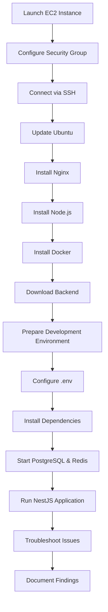

# 🚀 NestJS Backend Deployment on AWS EC2

This repository documents my attempt to deploy a **NestJS backend application** on an **AWS EC2 Ubuntu 24.04 LTS** server as part of a DevOps practical assignment.

The project covers the complete deployment workflow, including AWS infrastructure provisioning, Linux server configuration, Node.js setup, Docker installation, Nginx configuration, backend deployment, and the troubleshooting performed during the deployment process.

> **Note:** The backend deployment could not be completed because the AWS Free Tier EC2 instance ran out of available storage while downloading the required Docker images. This repository documents the deployment process, troubleshooting steps, and lessons learned.

---

# 📑 Table of Contents

- Objectives
- Tech Stack
- Deployment Status
- Repository Structure
- Deployment Architecture
- Deployment Workflow
- Documentation
- Challenges Faced
- Key Learnings
- Future Improvements
- Assignment
- Author

---

# 🎯 Objectives

- Launch an AWS EC2 Ubuntu server
- Configure a Linux environment for deployment
- Install and verify Nginx
- Install Node.js and npm
- Install Docker and Docker Compose
- Deploy a NestJS backend application
- Configure environment variables
- Run the application on port **9001**
- Configure Nginx as a reverse proxy
- Investigate and troubleshoot deployment issues

---

# 🛠️ Tech Stack

| Category | Technology |
|----------|------------|
| Cloud | AWS EC2 |
| Operating System | Ubuntu 24.04 LTS |
| Web Server | Nginx |
| Runtime | Node.js |
| Package Manager | npm |
| Containerization | Docker & Docker Compose |
| Backend | NestJS |
| Database | PostgreSQL |
| Cache | Redis |

---

# ✅ Deployment Status

| Task | Status |
|------|--------|
| EC2 Instance Provisioned | ✅ |
| Ubuntu Server Configured | ✅ |
| Nginx Installed | ✅ |
| Node.js Installed | ✅ |
| Docker Installed | ✅ |
| Backend Project Downloaded | ✅ |
| Dependencies Installed | ✅ |
| Environment Variables Configured | ✅ |
| PostgreSQL Container | ❌ |
| Redis Container | ❌ |
| Backend Running | ❌ |
| Reverse Proxy Tested | ❌ |
| Troubleshooting Completed | ✅ |

---

# 📂 Repository Structure

```text
.
├── ASSIGNMENT.md
├── README.md
├── 01-AWS-Setup
├── 02-Linux-Server-Setup
├── 03-Backend-Deployment
├── 04-Nginx-Reverse-Proxy
└── 05-Troubleshooting
```

---

# 🏗️ Deployment Architecture



> **Expected Architecture:** The NestJS application communicates with PostgreSQL and Redis running as Docker containers behind an Nginx reverse proxy.

> **Deployment Note:** Due to storage limitations on the AWS Free Tier EC2 instance, the PostgreSQL and Redis containers could not be started successfully, preventing the backend application from completing its startup.

---

# 🔄 Deployment Workflow



---

# 📖 Repository Documentation

| Section | Description |
|----------|-------------|
| **01-AWS-Setup** | EC2 provisioning, SSH configuration, Security Groups, and server creation |
| **02-Linux-Server-Setup** | Ubuntu configuration, package installation, Node.js, Docker, Nginx, and Linux monitoring commands |
| **03-Backend-Deployment** | Backend setup, dependency installation, environment configuration, Docker services, and deployment workflow |
| **04-Nginx-Reverse-Proxy** | Reverse proxy concepts, configuration, request flow, and verification steps |
| **05-Troubleshooting** | Deployment issues, root cause analysis, debugging process, Linux commands, and lessons learned |

---

# ⚠️ Challenges Faced

The deployment process exposed several infrastructure-related challenges while working with an AWS Free Tier EC2 instance.

The primary issue occurred when Docker attempted to download the PostgreSQL and Redis images. The limited storage available on the instance caused the root filesystem to become full, preventing the required containers from starting.

During troubleshooting, I:

- Verified disk and memory usage.
- Created a temporary swap file to complete dependency installation.
- Investigated Docker storage consumption.
- Reviewed system resources and service status.
- Removed temporary files and swap after troubleshooting.
- Attempted the deployment again after reclaiming storage.

Although the deployment could not be completed, the troubleshooting process provided valuable hands-on experience with Linux administration, Docker resource management, and deployment debugging.

---

# 📚 Key Learnings

- Provisioning cloud infrastructure using AWS EC2
- Configuring Ubuntu servers for application deployment
- Installing and managing Nginx
- Setting up Node.js environments
- Installing and configuring Docker
- Working with Docker Compose services
- Managing environment variables for backend applications
- Monitoring Linux memory and storage
- Diagnosing Docker image pull failures
- Troubleshooting deployment issues in resource-constrained environments
- Documenting deployment workflows and operational findings

---

# 🚀 Future Improvements

Given a larger EC2 instance or additional storage, the next steps would be:

- Complete the PostgreSQL and Redis deployment.
- Successfully start the NestJS backend.
- Configure and validate the Nginx reverse proxy.
- Secure the application using HTTPS.
- Containerize the complete application stack.
- Automate deployment using a CI/CD pipeline.

---

# 📌 Assignment

The original assignment brief is available in **ASSIGNMENT.md**.

---

## 👨‍💻 Author

**Yash Trivedi**

Aspiring DevOps & Cloud Engineer

GitHub: **github.com/yashtrivedi0402**
